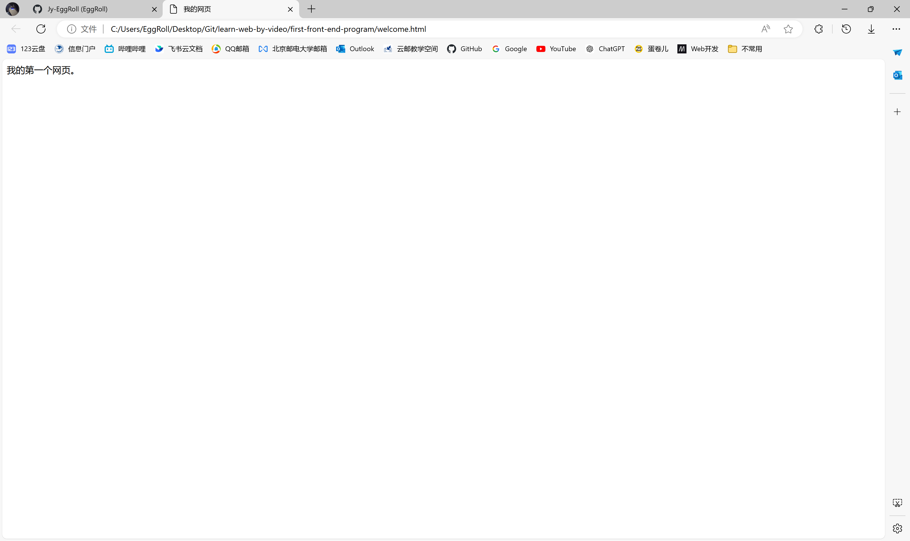

# 第一个前端程序

## 完成一个网页程序

以下是一个简单的HTML网页程序：

```html
<html>

<head>
    <title>我的网页</title>
</head>

<body>
    我的第一个网页。
</body>

</html>
```

This is a simple HTML web page program:

```html
<html>

<head>
    <title>My Webpage</title>
</head>

<body>
    My first webpage.
</body>

</html>
```

### 补充说明

1. **DOCTYPE声明**：在HTML5中，建议在文档的最顶部添加`<!DOCTYPE html>`声明，以确保浏览器以标准模式解析文档。
2. **语言属性**：可以在`<html>`标签中添加`lang`属性来指定文档的语言，如`<html lang="zh-CN">`。

补充后的完整代码如下：

### Additional Information

1. **DOCTYPE Declaration**: In HTML5, it's recommended to add the `<!DOCTYPE html>` declaration at the top of the document to ensure that browsers parse the document in standards mode.
2. **Language Attribute**: You can add the `lang` attribute in the `<html>` tag to specify the language of the document, such as `<html lang="en">`.

The complete code with supplements is as follows:

```html
<!DOCTYPE html>
<html lang="zh-CN">

<head>
    <meta charset="UTF-8">
    <title>我的网页</title>
</head>

<body>
    我的第一个网页。
</body>

</html>
```

```html
<!DOCTYPE html>
<html lang="en">

<head>
    <meta charset="UTF-8">
    <title>My Webpage</title>
</head>

<body>
    My first webpage.
</body>

</html>
```

### 解释
- `<!DOCTYPE html>`：声明文档类型为HTML5。
- `<html lang="zh-CN">`：指定文档的语言为简体中文。
- `<meta charset="UTF-8">`：设置文档的字符编码为UTF-8，确保在不同浏览器中正确显示文本。

### Explanation
- `<!DOCTYPE html>`: Declares the document type as HTML5.
- `<html lang="en">`: Specifies the language of the document as English.
- `<meta charset="UTF-8">`: Sets the character encoding of the document to UTF-8, ensuring text is displayed correctly in different browsers.

