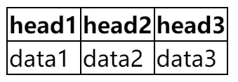

# 表格属性

使用CSS可以使表格更加美观。

## 表格边框

指定表格的边框，使用border属性。

```css
table {
  border: 1px solid black;
}
```

这是给表格的外侧加了一个边框，边框的宽度为1px，线条为实线，颜色为黑色。但是单元格并没有边框。

```css
table, th, td {
  border: 1px solid black;
}
```

这样，单元格也会有边框。

## 单元格边框折叠



```css
table {
  border-collapse: collapse;
}
```

这样单元格得边框就会折叠起来，显示单框。

## 表格的宽度和高度

```css
table {
  width: 100%;
  height: 100%;
}
```

## 文字对齐方式

td的默认对齐方式是左中，可以修改为：居中、右对齐。

```css
td {
  text-align: center; /* 居中 */
  text-align: right; /* 右对齐 */
}
```

垂直对齐方式：

```css
td {
  vertical-align: top; /* 顶部对齐 */
  vertical-align: middle; /* 居中对齐 */
  vertical-align: bottom; /* 底部对齐 */
}
```

## 边距填充

默认文字和表格之间用一定的大小来撑开。

```css
td {
    padding: 10px; /* 内边距 */
}
```

## 背景颜色

background-color属性可以设置单元格的背景颜色。

## 字体颜色

color属性可以设置单元格的字体颜色。