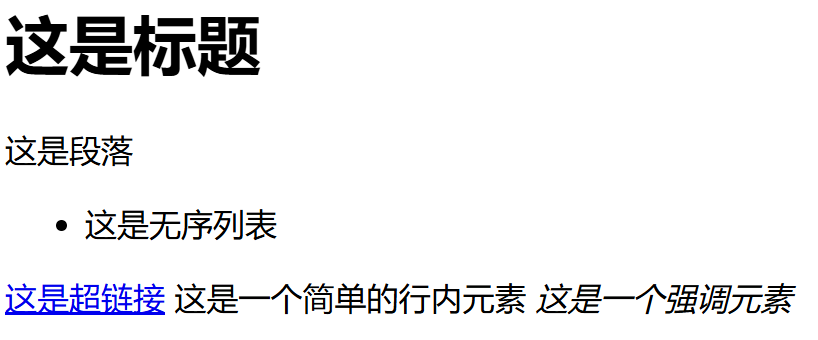

# HTML`
`和``标签

## HTML区块元素（块元素）

块级元素在浏览器显示的时候通常会以新的一行来开始和结束。也就是说，块级元素会独占一行。

块级元素可以设置宽度和高度属性。

一般块级元素可以包含其他块级元素和行内元素。

举例：`<h1>`、`
`、`<table>`都是区块元素。

## HTML内联元素（行内元素）

内联元素在显示的时候通常不会以新行开始。

行内元素设置宽度和高度属性是无效的。

内联元素包含的元素一般不包括块级元素。

举例：`<a>`、``、``、`<input>`都是内联元素。

## HTML`
`元素

1. `
`元素是块级元素，可以用来包裹其他元素，并设置样式。
2. `
`元素没有特定的含义，通常用来作为一个容器来设置样式。
3. `
`元素另一个常见的用法是文本布局。使用`<table>`来进行文本布局是老式的做法，而使用`
`来进行文本布局则是现代的做法。

## HTML``元素

1. ``元素是内联元素，可以用来包裹其他元素，并设置样式。
2. ``元素没有特定的含义，通常用来作为一个容器来设置样式。

## 行内块级元素

行内横向摆放，但是可以识别宽高属性。

比如：

- ``
- `<input>`
- `<button>`